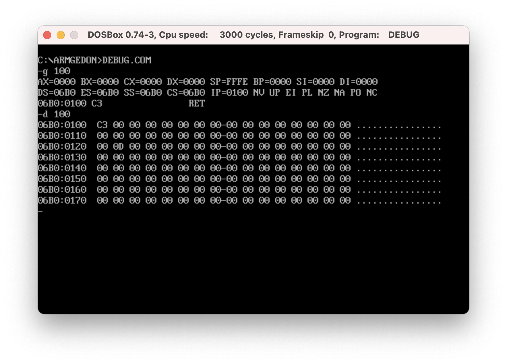
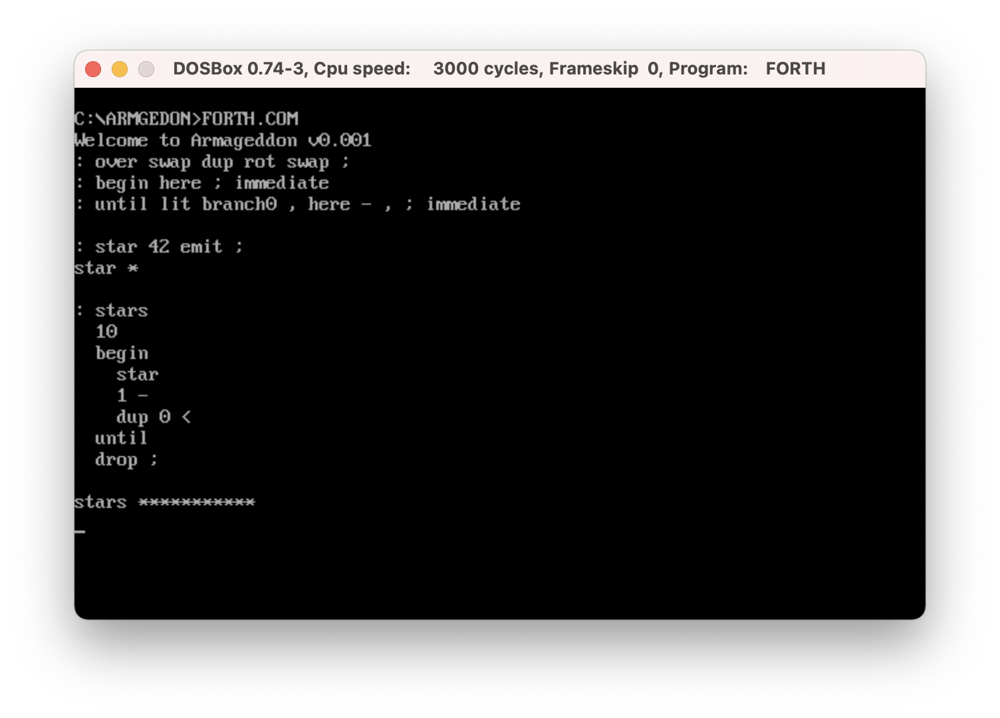

# Armageddon

### Creating a programming language out of nothing i.e. the Zombie Apocalypse Driven Development.

#### A programming language defined entirely in `DEBUG.COM`.

Imagine the earth is being destroyed by some virus-infected zombies. Technology is mostly wiped out. You desperately need to find a computer to develop the cure against the virus. You find shelter in an abandoned museum. The only computer available is 16 bit IBM AT 80286 with DOS installed on it. There is no programming language interpreter, there is no compiler available on that machine. You find a program called `DEBUG.COM` which is about 10k in size. The whole binary fits into 2-3 QR codes. 

You have no choice but to build a programming language in the debugger by laying out bits directly into the memory and dumping the result into the disk.

You start defining a FORTH. You write the [primitieves](forth.asm#L103) and the inner interpreter in assembly, you lay out dictionary structure in the memory. Then you compile the [text interpreter](forth.asm#L55) and the [defining words](forth.asm#L416) on paper then you enter each byte one by one. Then you can write the [control flow structures](CORE.FTH) in FORTH. 

After everything starts working, the next step will be to write a `meta-compiler` and create a new, more powerful FORTH out of the original version.

## Usage

 * Install DOSBox 0.74-3
 * `git clone git@github.com:zeroflag/armageddon.git`
 * `cd armageddon`
 * Start DosBox and run: `mount c /path/to/armageddon`
 * `C:`
 * `make.bat`
 * `forth.com`
 
 The `make.bat` script builds the project (by redirecting `forth.asm` to the stdin of `debug.com`), runs `forth.com` and loads `core.forth`. You can start `forth.com` afterwards, but by default the `core.forth` file is not loaded.
 You can do that manually by running `forth.com < core.forth`. Unfortunately there must be a `quit` at the end of `core.forth`, so you can't play with it interactivly because the process will exit (without the `quit` the process would hang because of how stdin redirect works in DOS). But you can start `forth.com` alone and type in commands interactivly (this is what I did on the 2nd screenshot).
 
 This thing is in early phase and very incomplete, and possibly buggy. There is no meta-compiler yet, but I want to build one at some point.
 
